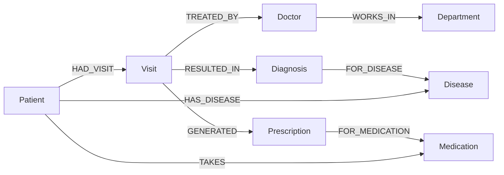

# Hospital Graph Explorer

A Next.js demonstration app that lets hospital staff explore a patient's
fictional medical history and the **graph of relationships** between Patients,
Visits, Doctors, Departments, Diseases, Medications, Diagnoses and
Prescriptions. It reads and writes **CognoDB** (a managed graph database)
through the official Neo4j JavaScript driver over Bolt, using parameterized
**Cypher**.

> **All data is synthetic.** This is a technical demonstration of graph
> traversal — it is not real clinical software.

The product's core value is *graph traversal*: multi-hop paths such as
"which doctor treated this patient, in which department, for which disease?"
and "which other patients are connected to this one through shared diseases,
medications, or doctors?" — questions that map directly onto paths in the
graph.

## Why a Graph Database?

The medical-history domain is a **relationship-first** domain. The questions
the product answers are about *how entities are connected*, not just what
their attributes are:

- **Q1 — Patient history**: everything connected to a patient (visits,
  doctors, diagnoses, medications) — a 1-hop ego query.
- **Q2 — Care pathway**: `Patient -> Visit -> Doctor -> Department` and
  `Patient -> Visit -> Diagnosis -> Disease` — 3-hop traversals that are the
  literal shape of a patient's care journey.
- **Q3 — Related patients**: patients sharing a Disease, Medication, or Doctor
  — found by traversing shared relationships, never by joining on string
  properties.
- **Q4 — Shortest path**: the shortest connection (≤ N hops) between a patient
  and a disease, medication, doctor, or another patient.
- **Q5 — Connected patients**: *all* patients reachable from a patient within
  a bounded depth, ranked by how many distinct connection paths exist.

In Cypher, each of these is expressed in a few lines of declarative pattern
matching, and the database executes the traversal natively:

```cypher
MATCH path = (p:Patient {publicId: $publicId})
  -[:HAS_DISEASE|TAKES|HAD_VISIT*1..6]-
  (other:Patient)
WHERE other <> p
RETURN other, [r IN relationships(path) | type(r)] AS pathPattern, count(path)
```

A relational implementation would need recursive CTEs and careful path
handling for the variable-depth cases (Q4/Q5). To be clear: **SQL can express
these queries** — the point is not that SQL is incapable, but that graphs make
multi-hop, variable-depth traversal a first-class operation rather than a
laborious one. For a bounded, well-understood dataset, that ergonomics
difference is the honest justification: the schema is the query, and
relationship types (`HAD_VISIT`, `TREATED_BY`, …) are first-class data rather
than join-table scaffolding.

## Architecture

```
┌──────────────────────────────────────────────────────────────┐
│  Next.js (App Router)                                         │
│  React client components (search, overview, graph, path)      │
│  ──────────────────────────────────────────────────────────── │
│  app/api/* route handlers   (thin: no Cypher, call services)  │
│  services/*                (validation + record → DTO mappers)│
│  lib/cognodb/queries/*     (parameterized Cypher, Q1–Q5)      │
│  lib/cognodb/driver.ts     (Neo4j driver singleton, server-only)│
└──────────────────────────────────────────────────────────────┘
                             │ Bolt
┌──────────────────────────────────────────────────────────────┐
│  CognoDB (managed Neo4j-compatible graph database)            │
│  Patients · Visits · Doctors · Departments · Diseases         │
│  Medications · Diagnoses · Prescriptions                      │
└──────────────────────────────────────────────────────────────┘
```

Layering rules that keep the demo honest:

- **API routes are thin** — they validate input (`services/validate.ts`),
  call a query, map records to DTOs, and return a uniform error envelope.
  No Cypher lives in `app/api/*`.
- **All Cypher is parameterized** — user input only ever enters queries via
  `$params`; the sole exception is a label chosen from a hard-coded
  allowlist (e.g. path targets, node-graph labels).
- **The driver is server-only** — `lib/cognodb/` imports `"server-only"` and
  is never imported by client components.
- **One source of truth** — the schema lives in
  [`docs/data-model.md`](docs/data-model.md); the Mermaid diagram below mirrors
  it and must stay in sync.

## Data model

8 node types and 9 typed, directed relationships. `Diagnosis` and
`Prescription` are nodes (not edge properties) because they carry their own
time-stamped facts and participate in traversal. `HAS_DISEASE` / `TAKES` model
the patient's *current* state (status + since), deliberately kept alongside
the historical visit path — see [`docs/data-model.md`](docs/data-model.md).



## Main queries

| # | Question | Relationships followed | Why traversal helps |
|---|----------|------------------------|---------------------|
| Q1 | What is this patient's full history? | `HAD_VISIT`, `TREATED_BY`, `WORKS_IN`, `RESULTED_IN`, `FOR_DISEASE`, `GENERATED`, `FOR_MEDICATION`, `HAS_DISEASE`, `TAKES` | One ego-subgraph query returns the patient and every adjacent entity, deduplicated — no N+1 joins. |
| Q2 | What was this patient's care journey? | `HAD_VISIT` → `TREATED_BY` → `WORKS_IN` (3 hops); `HAD_VISIT` → `RESULTED_IN` → `FOR_DISEASE` (3 hops) | The multi-hop path *is* the answer; Cypher matches it in one pattern. |
| Q3 | Which patients are related via shared entities? | shared `HAS_DISEASE`, shared `TAKES`, shared `TREATED_BY` (through visits) | "Related via a shared node" is a traversal over shared neighbors, not a property match. |
| Q4 | What is the shortest connection between a patient and a disease / medication / doctor / other patient? | any relationship chain, ≤ N hops (`shortestPath`) | Variable-length path finding is a built-in operation; the UI renders the actual hops with relationship labels. |
| Q5 | Which patients are reachable from this patient, and via how many paths? | `HAS_DISEASE`, `TAKES`, `HAD_VISIT` chains up to depth 10 | Variable-depth traversal + per-path counting (`count(path)`) would be recursive-CTE work in SQL. |
| Search | Where is this patient / doctor / disease / medication / department? | name / national-ID substring match | Powers every picker and the patient search box. |
| Expand | What is directly connected to this node in the graph? | 1-hop from any node | The graph explorer's "Expand relationships" step. |

Query modules live in `lib/cognodb/queries/` (`patientHistory.ts`,
`carePathway.ts`, `relatedPatients.ts`, `pathBetween.ts`,
`connectedPatients.ts`, `search.ts`, `entityGraph.ts`, `nodeGraph.ts`) and
are exposed via `app/api/*` routes; record→DTO mapping lives in
`services/*.ts`.

## Setup

### 1. Provision CognoDB

Create a CognoDB instance (managed Neo4j-compatible). The app connects over
Bolt, so the URI looks like `bolt+s://db-xxxx.databases.cognodb.cloud`.

### 2. Configure environment

```bash
cp .env.example .env.local
```

Fill in your instance values (`.env*` is gitignored — never commit real
credentials):

```bash
COGNODB_URI=bolt+s://db-xxxx.databases.cognodb.cloud
COGNODB_USERNAME=cognodb
COGNODB_PASSWORD=your-password
COGNODB_DATABASE=neo4j
```

### 3. Install and run

```bash
npm install
npm run seed        # idempotent: creates constraints + deterministic synthetic data
npm run dev         # http://localhost:3000
```

The seed is deterministic and safe to re-run.

### 4. Verify

Open `http://localhost:3000` and search for any patient (e.g. **Ashley Jones**),
open the graph explorer, or try **Path Explorer** to trace the shortest
connection between a patient and a disease.

## Testing

```bash
npm run typecheck   # tsc --noEmit (strict)
npm run lint        # next lint
npm test            # vitest — offline unit tests for services/mappers (no DB)
npm run test:integration  # live-DB tests, requires COGNODB_URI
```

## Demo

- **Live demo**: _pending deployment (Vercel)_
- **Screenshots**: _pending (final cleanup)_
- **Video walkthrough**: _pending_

## Repository map

| Path | Purpose |
|------|---------|
| `app/api/*` | Thin API routes (no Cypher) |
| `app/page.tsx` | Single-page UI shell (search → overview → graph / path explorer) |
| `components/` | React client components |
| `services/` | Validation + record→DTO mappers |
| `lib/cognodb/` | Driver, config, parameterized Cypher (server-only) |
| `lib/graph/` | Cytoscape.js graph engine (styles, layouts, payload transforms) |
| `scripts/seed/` | Deterministic, idempotent seed |
| `docs/data-model.md` | Authoritative schema (source of truth) |
| `tasks/` | Sequential task backlog (T-001 … T-016) |