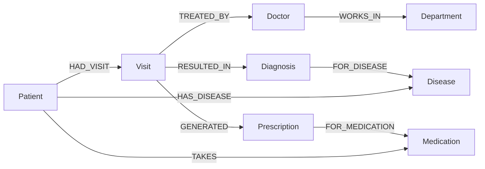

# Hospital Graph Explorer — Data Model

This is the **authoritative schema** for the application. UI, services, seed
script and Cypher queries all follow this document. If the schema changes,
update this file first and keep the Mermaid diagram in sync.

## Nodes

| Label | Properties | Notes |
|-------|-----------|-------|
| `Patient` | `id`, `publicId`, `nationalId`, `firstName`, `lastName`, `dateOfBirth`, `gender` | `id` is the internal uuid; `publicId` (e.g. `P-1001`) is shown in the UI; `nationalId` is a unique 12-digit national ID. |
| `Visit` | `id`, `visitDate`, `reason`, `notes` | A single encounter with a doctor. |
| `Doctor` | `id`, `name`, `specialty` | A treating physician. |
| `Department` | `id`, `name` | A clinical unit (e.g. Cardiology). |
| `Disease` | `id`, `name`, `category` | A condition (e.g. Type 2 Diabetes, category Metabolic). |
| `Medication` | `id`, `name`, `dosageForm` | A drug (e.g. Metformin, Tablet). |
| `Diagnosis` | `id`, `diagnosedAt`, `severity`, `notes` | A diagnosis made at a visit; kept as a node because it carries its own facts. |
| `Prescription` | `id`, `prescribedAt`, `dosage`, `frequency`, `duration` | A prescription issued at a visit; kept as a node because it carries dosage/frequency/duration. |

## Relationships (typed, directed)

| Type | From | To | Properties | Meaning |
|------|------|----|-----------|---------|
| `HAD_VISIT` | Patient | Visit | — | The patient attended this visit. |
| `TREATED_BY` | Visit | Doctor | — | This visit was handled by the doctor. |
| `WORKS_IN` | Doctor | Department | — | The doctor practices in the department. |
| `RESULTED_IN` | Visit | Diagnosis | — | The visit produced this diagnosis. |
| `FOR_DISEASE` | Diagnosis | Disease | — | The diagnosis was for this disease. |
| `GENERATED` | Visit | Prescription | — | The visit produced this prescription. |
| `FOR_MEDICATION` | Prescription | Medication | — | The prescription was for this medication. |
| `HAS_DISEASE` | Patient | Disease | `status` (`active`\|`resolved`), `since` | **Current-state edge**: the patient currently has (or had) this disease. |
| `TAKES` | Patient | Medication | `status` (`active`\|`discontinued`), `since` | **Current-state edge**: the patient currently takes (or took) this medication. |

## Current-state vs historical modeling

`HAS_DISEASE` and `TAKES` are kept even though the same Disease/Medication can be
reached through the visit path
(`Patient -[:HAD_VISIT]-> Visit -[:RESULTED_IN]-> Diagnosis -[:FOR_DISEASE]-> Disease`).

They exist because they answer a **different question**: "what is this patient's
current condition / current medication?" versus "what happened during a given
visit?" The visit-derived path models events with context (dates, notes,
severity); the current-state edges carry only `status` and `since`, modeling the
patient's present snapshot. This is a deliberate, non-redundant modeling choice
and is a good place to demonstrate graph-modeling reasoning.

`Diagnosis` and `Prescription` are nodes (not relationship properties) because
they carry their own time-stamped facts and participate in traversal (`Visit
-[:RESULTED_IN]-> Diagnosis -[:FOR_DISEASE]-> Disease` is a meaningful 2+ hop
path the product surfaces).

## Mermaid diagram

## Important multi-hop paths

- `Patient -> Visit -> Doctor -> Department` (3 hops)
- `Patient -> Visit -> Diagnosis -> Disease` (3 hops)
- `Patient -> Visit -> Prescription -> Medication` (3 hops)
- Related patients via shared `Disease` (`HAS_DISEASE`), shared `Medication`
  (`TAKES`), or a shared `Doctor` (`Visit -[:TREATED_BY]-> Doctor <-[:TREATED_BY]- Visit`)
